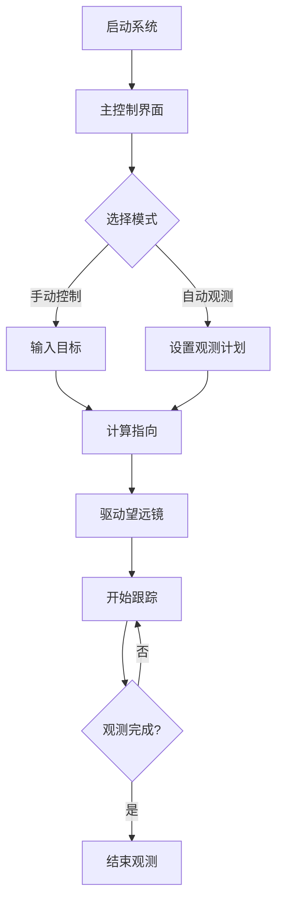

# OnStepX Telescope Controller 产品需求文档 (PRD)

## 1. 产品概述
OnStepX望远镜控制器项目旨在为天文学爱好者和专业天文台提供一个开源、可扩展的高级望远镜控制系统。作为OnStepX的核心版本，OnStepX支持更多类型的电机驱动（如Step/Dir, ODrive, Servo等），提供更强大的硬件兼容性和更丰富的功能特性。

- 解决传统望远镜控制器昂贵、封闭的问题
- 提供比标准OnStepX更强大的硬件支持和扩展性
- 支持多种望远镜 mount 类型和高级驱动方式

## 2. 核心功能

### 2.1 用户角色
| 角色 | 注册方式 | 核心权限 |
|------|----------|----------|
| 普通用户 | 无需注册 | 使用所有望远镜控制功能 |
| 开发者 | 代码贡献 | 修改源代码、提交新功能 |

### 2.2 功能模块
项目包含以下核心功能模块：
1. **主控制界面**: 望远镜状态显示、基本控制指令、实时位置反馈
2. **配置管理**: 参数设置、校准配置、硬件适配
3. **观测计划**: 目标管理、自动观测序列、日志记录

### 2.3 页面详情
| 页面名称 | 模块名称 | 功能描述 |
|----------|----------|----------|
| 主控制界面 | 状态显示区域 | 显示当前望远镜坐标、跟踪状态、时间信息 |
| 主控制界面 | 控制面板 | 提供方向控制、速度调节、停止按钮 |
| 主控制界面 | 目标输入 | 支持坐标输入、天体名称解析、同步功能 |
| 配置管理 | 硬件配置 | 设置电机参数、编码器类型、通信接口 |
| 配置管理 | 校准设置 | 极轴校准、指向模型、误差补偿 |
| 观测计划 | 目标列表 | 管理观测目标、优先级排序、状态跟踪 |
| 观测计划 | 序列控制 | 定义观测序列、自动化执行、条件判断 |

## 3. 核心流程
用户操作流程：
1. 系统启动后进入主控制界面
2. 用户可选择手动控制或设置观测计划
3. 手动控制模式下，用户输入目标坐标或选择天体
4. 系统自动计算并驱动望远镜指向目标
5. 开始跟踪并保持目标在视场中

## 4. 用户界面设计

### 4.1 设计风格
- **主色调**: 深空蓝 (#1a237e) 搭配星空银 (#e8eaf6)
- **按钮样式**: 扁平化设计，圆角矩形，悬停高亮
- **字体**: 优先使用系统默认无衬线字体，确保可读性
- **布局**: 卡片式布局，主要控制区域居中显示
- **图标**: 使用天文主题图标，如望远镜、星星、月亮等

### 4.2 页面设计概览
| 页面名称 | 模块名称 | UI元素 |
|----------|----------|--------|
| 主控制界面 | 状态显示 | 大字体显示RA/Dec坐标，状态指示器，进度条 |
| 主控制界面 | 控制按钮 | 方向键布局，速度滑块，紧急停止按钮 |
| 配置管理 | 参数表单 | 分组显示配置项，实时验证，保存提示 |
| 观测计划 | 数据表格 | 可排序列表，状态标识，操作按钮 |

### 4.3 响应式设计
采用桌面优先设计，适配大屏幕显示器，同时支持平板设备。主要考虑天文台环境下的使用场景，确保在夜间模式下界面清晰可读。

### 4.4 3D场景指导
项目包含虚拟天空视图功能：
- 环境: 深色太空背景，可切换昼夜模式
- 光照: 柔和的星空光照，突出显示当前目标
- 相机: 可旋转的3D视角，支持缩放和平移
- 交互: 点击天体获取信息，拖拽旋转视角
- 性能: 优化渲染性能，支持实时更新