# CoolEq System Design Concept

Based on the [Project Plan](project-plan.md), here is the system architecture concept diagram.

## System Architecture Diagram (Mermaid)

```mermaid
graph TD
    subgraph External["External Environment"]
        User["User (App/Web)"]
        ASIAIR["External Device (e.g., ASIAIR)"]
    end

    subgraph CoolEq["CoolEq System (All-in-One)"]
        
        subgraph Power["Power Management"]
            PowerInput["12V Input"]
            PMU["PMU (12V -> 5V)"]
        end

        subgraph Brain["Smart Host (SBC)"]
            RPi["Raspberry Pi 4/5"]
            Soft_INDI["INDI Server"]
            Soft_Daemon["CoolEq Daemon"]
            Soft_ASTAP["ASTAP (Solver)"]
            
            RPi -- Runs --> Soft_INDI
            RPi -- Runs --> Soft_Daemon
            RPi -- Runs --> Soft_ASTAP
        end

        subgraph Motion["Motion Control (MCU)"]
            ESP32["ESP32 (Fysetc E4)"]
            Firmware["OnStepX Firmware"]
            
            ESP32 -- Runs --> Firmware
        end

        subgraph Connectivity["Connectivity & Switching"]
            USBMux["USB Mux (HD3SS3212)"]
            ExtUSB["External USB Port"]
        end

        subgraph Hardware["Mechanical & Sensors"]
            subgraph Imaging["Imaging Train"]
                MainCam["Main Camera (USB 3.0)"]
            end

            subgraph Guiding["Guiding System"]
                GuideCam["Guide Camera (USB 2.0)"]
                noteGuide["> Core Visual Sensor\n> See guide_scope_design.md"]
            end
            
            subgraph TrackingHead["Tracking Head (Harmonic)"]
                MotorRA["RA Motor (NEMA 17)"]
                MotorDec["Dec Motor (NEMA 17)"]
            end
            
            subgraph AlignmentBase["Alignment Base (Worm/Screw)"]
                MotorAlt["Alt Motor (NEMA 17/23)"]
                MotorAz["Az Motor (NEMA 17/23)"]
            end
            
            Sensors["Sensors (GPS / MPU6050)"]
        end

        %% Power Connections
        PowerInput ==> PMU
        PMU ==> RPi
        PMU ==> ESP32
        PowerInput ==> MotorRA
        PowerInput ==> MotorDec
        PowerInput ==> MotorAlt
        PowerInput ==> MotorAz

        %% Data & Control Flows
        User <==>|"WiFi / Network"| RPi
        
        %% Internal Logic
        Soft_Daemon --"1. Solve & Sync"--> Soft_ASTAP
        Soft_Daemon --"2. Correction Cmd"--> ESP32
        
        %% SBC to MCU
        RPi <==>|"UART / USB"| ESP32
        
        %% MCU Control
        ESP32 -->|"Pulse/Dir (TMC2209)"| MotorRA
        ESP32 -->|"Pulse/Dir (TMC2209)"| MotorDec
        ESP32 -->|"Pulse/Dir (TMC2209)"| MotorAlt
        ESP32 -->|"Pulse/Dir (TMC2209)"| MotorAz
        ESP32 <==>|"I2C / UART"| Sensors

        %% USB Mux Logic
        MainCam ==>|"USB 3.0"| USBMux
        GuideCam ==>|"USB 2.0"| RPi
        
        RPi -.->|"GPIO Control (Switch)"| USBMux
        
        USBMux ==>|"Path A: Local Mode (Preview/PlateSolve?)"| RPi
        USBMux ==>|"Path B: Passthrough Mode"| ExtUSB
        
        ExtUSB <==>|"USB Cable"| ASIAIR
    end

    classDef computing fill:#f9f,stroke:#333,stroke-width:2px;
    classDef mechanics fill:#ccf,stroke:#333,stroke-width:1px;
    classDef external fill:#eee,stroke:#333,stroke-width:1px,stroke-dasharray: 5 5;
    classDef switching fill:#ff9,stroke:#333,stroke-width:2px;

    class RPi,ESP32 computing;
    class MotorRA,MotorDec,MotorAlt,MotorAz,Cam,Sensors mechanics;
    class User,ASIAIR external;
    class USBMux switching;
```

## Key Flows

1.  **Auto Alignment (Local Mode)**
    *   **Camera** sends images to **RPi** via **USB Mux (Path A)**.
    *   **RPi** (ASTAP) solves the plate.
    *   **RPi** calculates error and sends correction commands to **ESP32**.
    *   **ESP32** drives **Alt/Az Motors** to align the mount.

2.  **Handover (Passthrough Mode)**
    *   After alignment, **RPi** signals **USB Mux** via GPIO.
    *   **USB Mux** switches **Camera** signal to **External USB Port (Path B)**.
    *   **ASIAIR** takes full control of the camera and mount (via OnStep driver).
