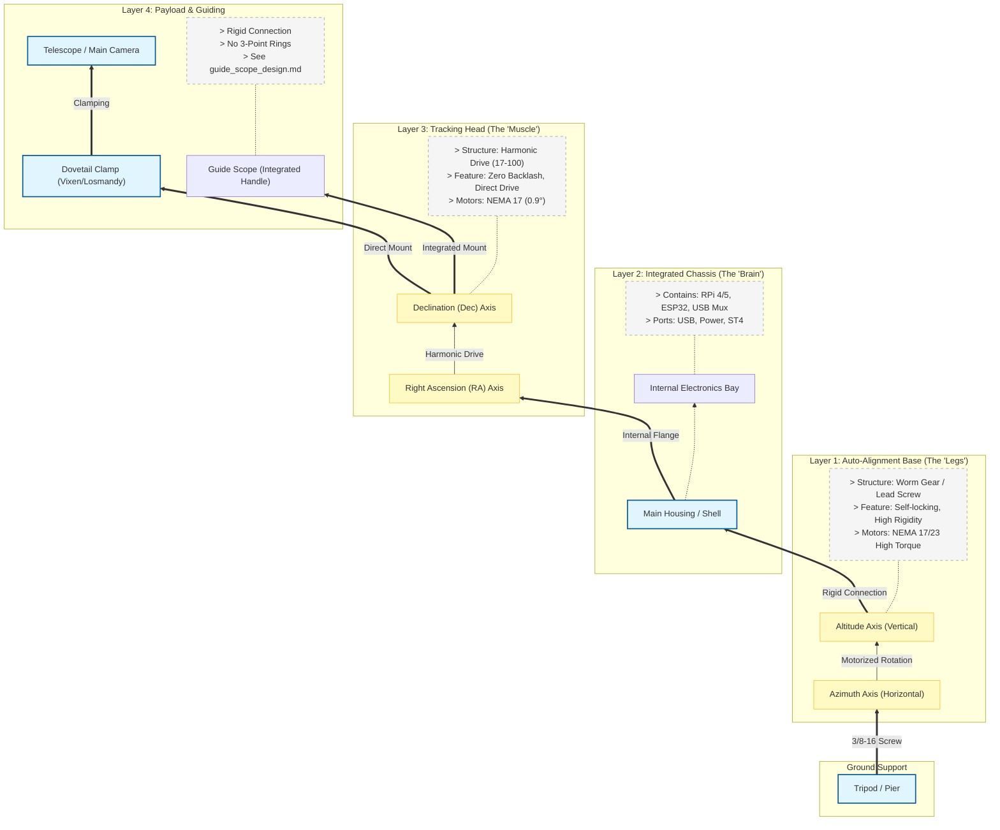

# CoolEq Mechanical Concept

Based on the [Project Plan](project-plan.md), here is the mechanical stacking and structural concept diagram.

## Mechanical Stack Diagram (Mermaid)

This diagram illustrates the physical hierarchy from the ground up to the payload.

## Mechanical Modules Detail

### 1. Payload Layer
*   **Interface**: Standard Vixen or Losmandy dovetail clamp.
*   **Role**: Securely holds the imaging train (OTA, Camera, Filter Wheel).

### 2. Tracking Head (Upper Layer)
*   **Core Component**: Harmonic Drives (Strain Wave Gears). Recommended model 17-100 or 14-100 depending on payload target.
*   **Advantage**: High torque-to-weight ratio, no counterweight needed for small/medium payloads, zero backlash.
*   **Motors**: NEMA 17 Stepper Motors (0.9° step angle for finer resolution).

### 3. Integrated Chassis (Middle Layer)
*   **Role**: Structural backbone connecting the tracking head to the alignment base.
*   **Internal**: Houses the PCB stack (Motion MCU + SBC + Power + USB Mux).
*   **Cable Management**: Internal routing to minimize cable snagging.

### 4. Alignment Base (Lower Layer)
*   **Role**: Performs the physical Polar Alignment.
*   **Mechanism**:
    *   **Azimuth**: Motorized turntable or push-pull screw driven by stepper.
    *   **Altitude**: Motorized lead screw or worm gear wedge.
*   **Requirement**: Must be self-locking (cannot slip when power is off) and rigid.
*   **Motors**: NEMA 23 or high-torque NEMA 17 to lift the entire assembly weight.
